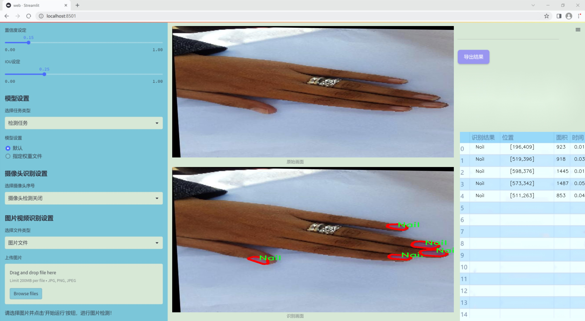
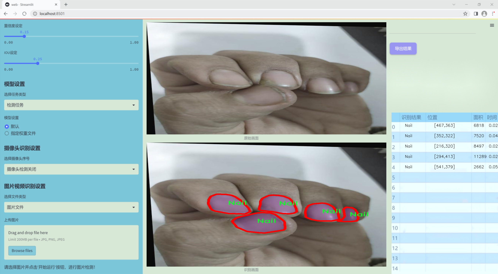
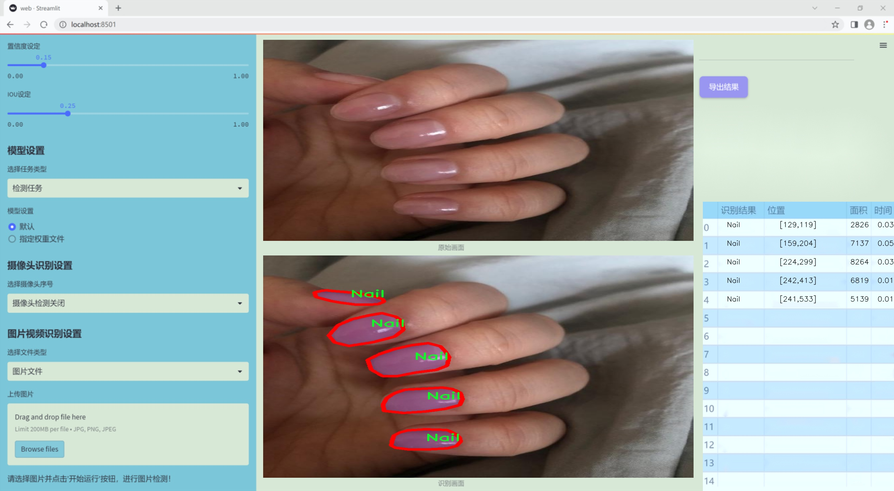
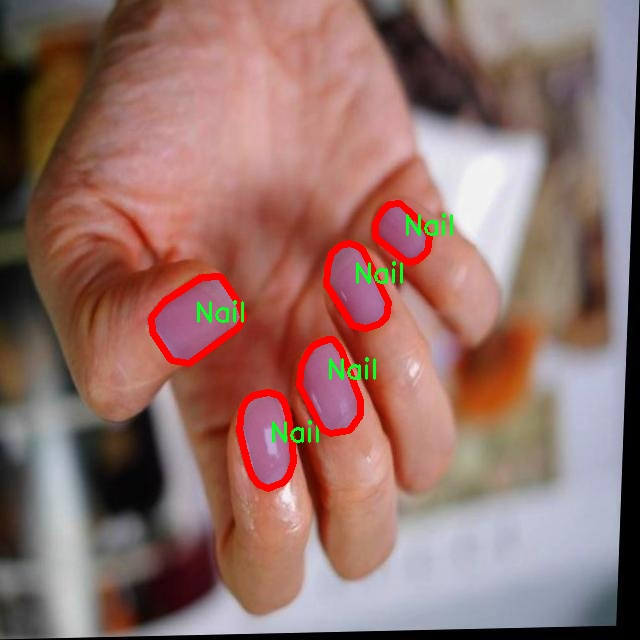
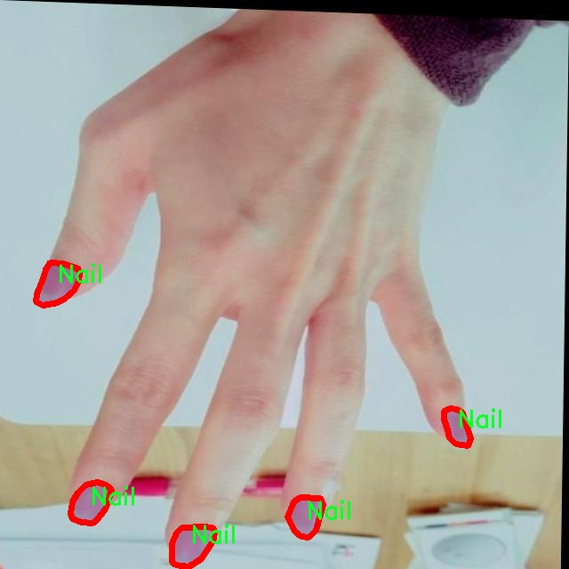
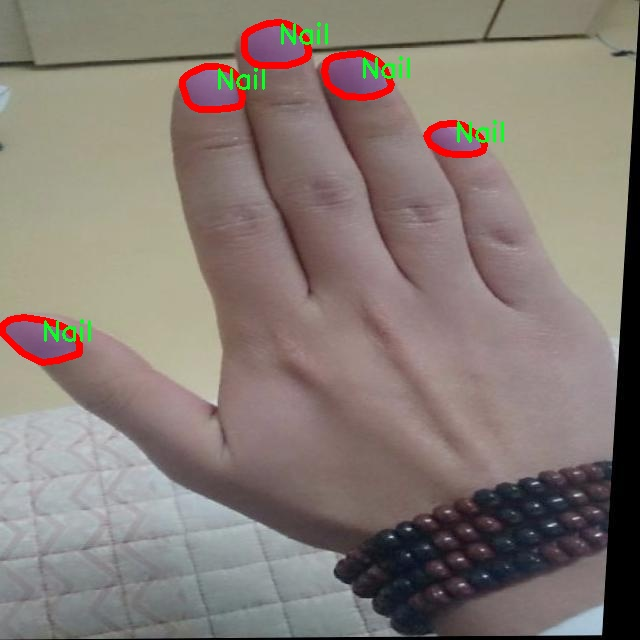
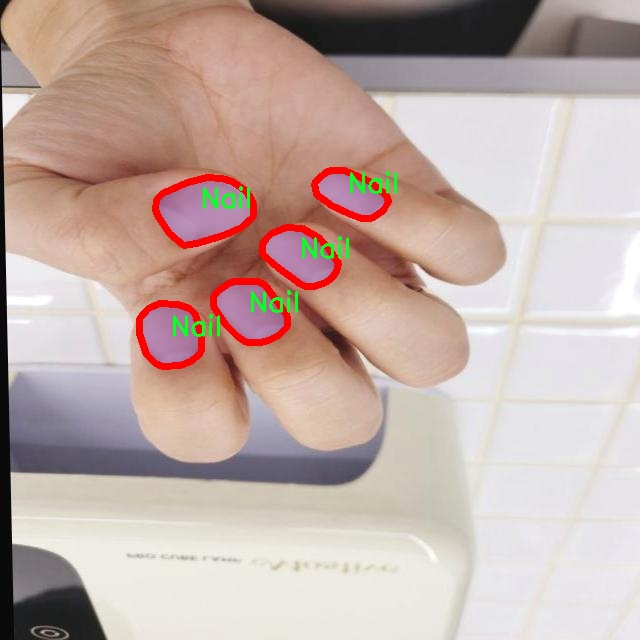

### 1.背景意义

研究背景与意义

随着计算机视觉技术的迅猛发展，物体检测和实例分割在多个领域中得到了广泛应用，尤其是在医疗健康、工业检测和美容护理等行业。指甲检测作为一种特定的视觉识别任务，近年来逐渐受到关注。指甲的健康状况不仅反映了个体的整体健康水平，还与多种疾病的早期诊断密切相关。因此，开发一种高效、准确的指甲检测系统具有重要的实际意义。

本研究旨在基于改进的YOLOv11模型，构建一个高效的指甲检测系统。YOLO（You Only Look Once）系列模型以其实时性和高准确率而闻名，尤其适合于需要快速处理和识别的场景。通过对YOLOv11的改进，我们期望在保持高检测精度的同时，进一步提升模型的运行速度和适应性，以满足实际应用需求。

本项目使用的数据集包含10,000张指甲图像，经过精心标注，确保了数据的高质量和多样性。该数据集的单一类别“指甲”使得模型训练更加专注，能够深入学习指甲的特征和变化。通过对数据集的合理利用，结合YOLOv11的先进技术，我们将能够有效提升指甲检测的准确性和效率。

此外，指甲检测系统的成功应用不仅可以帮助专业人士进行更准确的健康评估，还能为普通用户提供自我检测的工具，促进公众对指甲健康的关注。综上所述，本研究不仅在技术上具有创新性，也在社会健康管理中具有重要的应用价值。

### 2.视频效果

[2.1 视频效果](https://www.bilibili.com/video/BV1WdkFY9EQw/)

### 3.图片效果







##### [项目涉及的源码数据来源链接](https://kdocs.cn/l/cszuIiCKVNis)**

注意：本项目提供训练的数据集和训练教程,由于版本持续更新,暂不提供权重文件（best.pt）,请按照6.训练教程进行训练后实现上图演示的效果。

### 4.数据集信息

##### 4.1 本项目数据集类别数＆类别名

nc: 1
names: ['Nail']


该项目为【图像分割】数据集，请在【训练教程和Web端加载模型教程（第三步）】这一步的时候按照【图像分割】部分的教程来训练

##### 4.2 本项目数据集信息介绍

本项目数据集信息介绍

本项目旨在改进YOLOv11模型，以实现高效的指甲检测系统。为此，我们构建了一个专门针对“指甲”主题的数据集，该数据集包含丰富的图像资源，旨在提升模型在指甲识别任务中的准确性和鲁棒性。数据集中包含的类别数量为1，具体类别为“指甲”，这意味着所有图像均围绕这一单一主题展开，确保了数据集的专一性和针对性。

在数据集的构建过程中，我们收集了来自不同环境和条件下的指甲图像，以确保模型能够在多样化的场景中进行有效识别。这些图像涵盖了不同的指甲形状、颜色、长度以及健康状态，反映了指甲的多样性和复杂性。此外，为了增强数据集的代表性，我们还考虑了不同光照条件、拍摄角度和背景的变化，使得模型在实际应用中能够更好地适应各种情况。

数据集的图像经过精心标注，确保每个图像中的指甲部分都得到了准确的框定和标识。这一过程不仅提高了数据集的质量，也为后续的模型训练提供了可靠的基础。通过使用这一数据集，我们期望改进YOLOv11在指甲检测任务中的性能，使其能够在医疗、时尚等多个领域中发挥重要作用。

总之，本项目的数据集为指甲检测系统的训练提供了全面而丰富的图像数据，旨在通过改进YOLOv11模型，推动指甲识别技术的发展，最终实现更高效、更准确的指甲检测解决方案。










### 5.全套项目环境部署视频教程（零基础手把手教学）

[5.1 所需软件PyCharm和Anaconda安装教程（第一步）](https://www.bilibili.com/video/BV1BoC1YCEKi/?spm_id_from=333.999.0.0&vd_source=bc9aec86d164b67a7004b996143742dc)


[5.2 安装Python虚拟环境创建和依赖库安装视频教程（第二步）](https://www.bilibili.com/video/BV1ZoC1YCEBw?spm_id_from=333.788.videopod.sections&vd_source=bc9aec86d164b67a7004b996143742dc)

### 6.改进YOLOv11训练教程和Web_UI前端加载模型教程（零基础手把手教学）

[6.1 改进YOLOv11训练教程和Web_UI前端加载模型教程（第三步）](https://www.bilibili.com/video/BV1BoC1YCEhR?spm_id_from=333.788.videopod.sections&vd_source=bc9aec86d164b67a7004b996143742dc)


按照上面的训练视频教程链接加载项目提供的数据集，运行train.py即可开始训练



     Epoch   gpu_mem       box       obj       cls    labels  img_size
     1/200     20.8G   0.01576   0.01955  0.007536        22      1280: 100%|██████████| 849/849 [14:42<00:00,  1.04s/it]
               Class     Images     Labels          P          R     mAP@.5 mAP@.5:.95: 100%|██████████| 213/213 [01:14<00:00,  2.87it/s]
                 all       3395      17314      0.994      0.957      0.0957      0.0843

     Epoch   gpu_mem       box       obj       cls    labels  img_size
     2/200     20.8G   0.01578   0.01923  0.007006        22      1280: 100%|██████████| 849/849 [14:44<00:00,  1.04s/it]
               Class     Images     Labels          P          R     mAP@.5 mAP@.5:.95: 100%|██████████| 213/213 [01:12<00:00,  2.95it/s]
                 all       3395      17314      0.996      0.956      0.0957      0.0845

     Epoch   gpu_mem       box       obj       cls    labels  img_size
     3/200     20.8G   0.01561    0.0191  0.006895        27      1280: 100%|██████████| 849/849 [10:56<00:00,  1.29it/s]
               Class     Images     Labels          P          R     mAP@.5 mAP@.5:.95: 100%|███████   | 187/213 [00:52<00:00,  4.04it/s]
                 all       3395      17314      0.996      0.957      0.0957      0.0845


###### [项目数据集下载链接](https://kdocs.cn/l/cszuIiCKVNis)

### 7.原始YOLOv11算法讲解


##### YOLO11介绍

Ultralytics YOLO11是一款尖端的、最先进的模型，它在之前YOLO版本成功的基础上进行了构建，并引入了新功能和改进，以进一步提升性能和灵活性。
**YOLO11设计快速、准确且易于使用，使其成为各种物体检测和跟踪、实例分割、图像分类以及姿态估计任务的绝佳选择。**


**结构图如下：**


##### **C3k2**

**C3k2，结构图如下**


**C3k2，继承自类`C2f，其中通过c3k设置False或者Ture来决定选择使用C3k还是`**Bottleneck


**实现代码** **ultralytics/nn/modules/block.py**

##### C2PSA介绍

**借鉴V10 PSA结构，实现了C2PSA和C2fPSA，最终选择了基于C2的C2PSA（可能涨点更好？）**


**实现代码** **ultralytics/nn/modules/block.py**

##### Detect介绍

**分类检测头引入了DWConv（更加轻量级，为后续二次创新提供了改进点），结构图如下（和V8的区别）：**


### 8.200+种全套改进YOLOV11创新点原理讲解

#### 8.1 200+种全套改进YOLOV11创新点原理讲解大全

由于篇幅限制，每个创新点的具体原理讲解就不全部展开，具体见下列网址中的改进模块对应项目的技术原理博客网址【Blog】（创新点均为模块化搭建，原理适配YOLOv5~YOLOv11等各种版本）

[改进模块技术原理博客【Blog】网址链接](https://gitee.com/qunmasj/good)


#### 8.2 精选部分改进YOLOV11创新点原理讲解

###### 这里节选部分改进创新点展开原理讲解(完整的改进原理见上图和[改进模块技术原理博客链接](https://gitee.com/qunmasj/good)【如果此小节的图加载失败可以通过CSDN或者Github搜索该博客的标题访问原始博客，原始博客图片显示正常】

### 可扩张残差（DWR）注意力模块
当前的许多工作直接采用多速率深度扩张卷积从一个输入特征图中同时捕获多尺度上下文信息，从而提高实时语义分割的特征提取效率。 然而，这种设计可能会因为结构和超参数的不合理而导致多尺度上下文信息的访问困难。 为了降低绘制多尺度上下文信息的难度，我们提出了一种高效的多尺度特征提取方法，该方法分解了原始的单步特征提取方法方法分为两个步骤，区域残差-语义残差。 在该方法中，多速率深度扩张卷积在特征提取中发挥更简单的作用：根据第一步提供的每个简明区域形式特征图，在第二步中使用一个所需的感受野执行简单的基于语义的形态过滤 一步，提高他们的效率。 此外，扩张率和扩张卷积的容量每个网络阶段都经过精心设计，以充分利用所有可以实现的区域形式的特征图。 因此，我们分别为高层和低层网络设计了一种新颖的扩张式残差（DWR）模块和简单倒置残差（SIR）模块。


首先，该博客引入了一个Dilation-wise Residual（DWR）模块，用于提取网络高层的特征，如图2a所示。多分支结构用于扩展感受野，其中每个分支采用不同空洞率的空洞深度卷积。
然后，专门设计了一个Simple Inverted Residual（SIR）模块来提取网络低层的特征，如图2b所示。该模块仅具有3×3的微小感受野，但使用inverted bottleneck式结构来扩展通道数量，确保更强的特征提取能力。
最后，基于DWR和SIR模块，构建了一个编码器-解码器风格的网络DWRSeg，其中解码器采用了简单的类似FCN的结构。解码器使用来自最后两个阶段的强语义信息直接对特征图进行上采样，然后将它们与来自较低阶段的特征图（包含丰富的详细信息）拼接起来，以进行最终预测。


### 9.系统功能展示

图9.1.系统支持检测结果表格显示

  图9.2.系统支持置信度和IOU阈值手动调节

  图9.3.系统支持自定义加载权重文件best.pt(需要你通过步骤5中训练获得)

  图9.4.系统支持摄像头实时识别

  图9.5.系统支持图片识别

  图9.6.系统支持视频识别

  图9.7.系统支持识别结果文件自动保存

  图9.8.系统支持Excel导出检测结果数据


### 10. YOLOv11核心改进源码讲解

#### 10.1 hcfnet.py

以下是代码中最核心的部分，并附上详细的中文注释：

```python
import torch
import torch.nn as nn
import torch.nn.functional as F

# 定义空间注意力模块
class SpatialAttentionModule(nn.Module):
    def __init__(self):
        super(SpatialAttentionModule, self).__init__()
        # 2通道输入，1通道输出的卷积层，卷积核大小为7，步幅为1，填充为3
        self.conv2d = nn.Conv2d(in_channels=2, out_channels=1, kernel_size=7, stride=1, padding=3)
        self.sigmoid = nn.Sigmoid()  # Sigmoid激活函数

    def forward(self, x):
        # 计算输入x的平均值和最大值
        avgout = torch.mean(x, dim=1, keepdim=True)  # 在通道维度上取平均
        maxout, _ = torch.max(x, dim=1, keepdim=True)  # 在通道维度上取最大值
        out = torch.cat([avgout, maxout], dim=1)  # 将平均值和最大值拼接
        out = self.sigmoid(self.conv2d(out))  # 通过卷积和Sigmoid激活
        return out * x  # 乘以输入x，得到加权后的输出

# 定义局部-全局注意力模块
class LocalGlobalAttention(nn.Module):
    def __init__(self, output_dim, patch_size):
        super().__init__()
        self.output_dim = output_dim
        self.patch_size = patch_size
        self.mlp1 = nn.Linear(patch_size * patch_size, output_dim // 2)  # MLP层1
        self.norm = nn.LayerNorm(output_dim // 2)  # 层归一化
        self.mlp2 = nn.Linear(output_dim // 2, output_dim)  # MLP层2
        self.conv = nn.Conv2d(output_dim, output_dim, kernel_size=1)  # 1x1卷积
        self.prompt = torch.nn.parameter.Parameter(torch.randn(output_dim, requires_grad=True))  # 可学习的参数
        self.top_down_transform = torch.nn.parameter.Parameter(torch.eye(output_dim), requires_grad=True)  # 顶层变换

    def forward(self, x):
        x = x.permute(0, 2, 3, 1)  # 变换维度顺序
        B, H, W, C = x.shape  # 获取批量大小、高度、宽度和通道数
        P = self.patch_size  # 获取补丁大小

        # 局部分支
        local_patches = x.unfold(1, P, P).unfold(2, P, P)  # 获取局部补丁
        local_patches = local_patches.reshape(B, -1, P * P, C)  # 重塑形状
        local_patches = local_patches.mean(dim=-1)  # 在通道维度上取平均

        local_patches = self.mlp1(local_patches)  # 通过MLP层1
        local_patches = self.norm(local_patches)  # 归一化
        local_patches = self.mlp2(local_patches)  # 通过MLP层2

        local_attention = F.softmax(local_patches, dim=-1)  # 计算局部注意力
        local_out = local_patches * local_attention  # 加权输出

        # 计算余弦相似度
        cos_sim = F.normalize(local_out, dim=-1) @ F.normalize(self.prompt[None, ..., None], dim=1)  # 计算余弦相似度
        mask = cos_sim.clamp(0, 1)  # 限制在[0, 1]范围内
        local_out = local_out * mask  # 应用掩码
        local_out = local_out @ self.top_down_transform  # 顶层变换

        # 恢复形状
        local_out = local_out.reshape(B, H // P, W // P, self.output_dim)  # 重塑形状
        local_out = local_out.permute(0, 3, 1, 2)  # 变换维度顺序
        local_out = F.interpolate(local_out, size=(H, W), mode='bilinear', align_corners=False)  # 上采样
        output = self.conv(local_out)  # 通过1x1卷积

        return output  # 返回输出

# 定义PPA模块
class PPA(nn.Module):
    def __init__(self, in_features, filters) -> None:
        super().__init__()
        self.skip = nn.Conv2d(in_features, filters, kernel_size=1)  # 跳跃连接
        self.c1 = nn.Conv2d(filters, filters, kernel_size=3, padding=1)  # 卷积层1
        self.c2 = nn.Conv2d(filters, filters, kernel_size=3, padding=1)  # 卷积层2
        self.c3 = nn.Conv2d(filters, filters, kernel_size=3, padding=1)  # 卷积层3
        self.sa = SpatialAttentionModule()  # 空间注意力模块
        self.lga2 = LocalGlobalAttention(filters, 2)  # 局部-全局注意力模块（补丁大小为2）
        self.lga4 = LocalGlobalAttention(filters, 4)  # 局部-全局注意力模块（补丁大小为4）
        self.bn1 = nn.BatchNorm2d(filters)  # 批归一化
        self.silu = nn.SiLU()  # SiLU激活函数

    def forward(self, x):
        x_skip = self.skip(x)  # 跳跃连接
        x_lga2 = self.lga2(x_skip)  # 局部-全局注意力
        x_lga4 = self.lga4(x_skip)  # 局部-全局注意力
        x1 = self.c1(x)  # 卷积层1
        x2 = self.c2(x1)  # 卷积层2
        x3 = self.c3(x2)  # 卷积层3
        x = x1 + x2 + x3 + x_skip + x_lga2 + x_lga4  # 融合特征
        x = self.bn1(x)  # 批归一化
        x = self.silu(x)  # SiLU激活
        return x  # 返回输出
```

### 说明
1. **SpatialAttentionModule**: 这个模块实现了空间注意力机制，通过计算输入特征图的平均值和最大值来生成注意力权重，并对输入进行加权。
2. **LocalGlobalAttention**: 该模块通过局部和全局特征的结合来增强特征表示。它首先提取局部补丁，然后通过两层MLP进行处理，并计算注意力权重。
3. **PPA**: 该模块结合了多个卷积层、空间注意力和局部-全局注意力模块，通过跳跃连接和特征融合来增强特征表示。

以上是核心部分的详细注释，提供了对每个模块的功能和实现方式的清晰理解。

这个程序文件 `hcfnet.py` 实现了一个深度学习模型，主要用于图像处理任务。代码中定义了多个神经网络模块，包括空间注意力模块、局部全局注意力模块、ECA（Efficient Channel Attention）模块、PPA（Patch-wise Attention）模块和DASI（Dynamic Attention with Skip Connections）模块。以下是对各个部分的详细说明。

首先，`SpatialAttentionModule` 类实现了一个空间注意力机制。它通过计算输入特征图的平均值和最大值来生成一个注意力图，然后通过卷积层和Sigmoid激活函数对其进行处理，最终将注意力图与输入特征图相乘，以突出重要的空间信息。

接下来，`LocalGlobalAttention` 类实现了局部和全局注意力机制。它首先将输入特征图划分为多个局部补丁，然后通过多层感知机（MLP）对这些补丁进行处理，生成局部特征。接着，计算这些局部特征的余弦相似度，并通过一个掩码来调整特征，最后将处理后的特征恢复到原始的空间尺寸，并通过卷积层输出结果。

`ECA` 类实现了一种高效的通道注意力机制。它通过自适应平均池化将输入特征图压缩为一个标量，然后通过一维卷积和Sigmoid激活函数生成通道注意力权重，最后将这些权重应用于输入特征图，以增强重要通道的特征。

`PPA` 类是一个复合模块，结合了前面提到的多个模块。它首先通过卷积层进行特征提取，然后使用局部全局注意力模块和空间注意力模块来增强特征。最后，通过Dropout、批归一化和SiLU激活函数进行处理，输出最终的特征图。

`Bag` 类实现了一个简单的加权融合机制，它根据输入的边缘注意力值对特征进行加权，结合不同来源的特征。

最后，`DASI` 类是一个动态注意力模块，它通过多个跳跃连接来处理不同尺度的特征。根据输入特征的不同组合，使用卷积层进行特征融合，并通过批归一化和SiLU激活函数进行处理，最终输出融合后的特征图。

整个文件通过组合这些模块，构建了一个复杂的深度学习模型，旨在通过注意力机制有效地提取和融合图像特征，以提高图像处理任务的性能。

#### 10.2 revcol.py

以下是代码中最核心的部分，并附上详细的中文注释：

```python
import torch
import torch.nn as nn

class ReverseFunction(torch.autograd.Function):
    @staticmethod
    def forward(ctx, run_functions, alpha, *args):
        # 保存运行函数和缩放因子
        ctx.run_functions = run_functions
        ctx.alpha = alpha
        
        # 获取输入参数
        x, c0, c1, c2, c3 = args
        
        # 使用无梯度上下文来计算前向传播
        with torch.no_grad():
            # 依次调用运行函数，计算输出并加上缩放因子
            c0 = run_functions[0](x, c1) + c0 * alpha[0]
            c1 = run_functions[1](c0, c2) + c1 * alpha[1]
            c2 = run_functions[2](c1, c3) + c2 * alpha[2]
            c3 = run_functions[3](c2, None) + c3 * alpha[3]
        
        # 保存计算结果以便在反向传播中使用
        ctx.save_for_backward(x, c0, c1, c2, c3)
        return x, c0, c1, c2, c3

    @staticmethod
    def backward(ctx, *grad_outputs):
        # 获取保存的张量
        x, c0, c1, c2, c3 = ctx.saved_tensors
        run_functions = ctx.run_functions
        alpha = ctx.alpha
        
        # 计算梯度
        gx, g0, g1, g2, g3 = grad_outputs
        
        # 反向传播计算
        # 依次调用运行函数的反向传播
        g3_up = g3
        g3_left = g3_up * alpha[3]
        oup3 = run_functions[3](c2, None)
        torch.autograd.backward(oup3, g3_up, retain_graph=True)
        
        # 继续反向传播
        g2_up = g2 + c2.grad
        g2_left = g2_up * alpha[2]
        oup2 = run_functions[2](c1, c3)
        torch.autograd.backward(oup2, g2_up, retain_graph=True)
        
        g1_up = g1 + c1.grad
        g1_left = g1_up * alpha[1]
        oup1 = run_functions[1](c0, c2)
        torch.autograd.backward(oup1, g1_up, retain_graph=True)
        
        g0_up = g0 + c0.grad
        g0_left = g0_up * alpha[0]
        oup0 = run_functions[0](x, c1)
        torch.autograd.backward(oup0, g0_up)

        # 返回梯度
        return None, None, gx, g0_left, g1_left, g2_left, g3_left

class SubNet(nn.Module):
    def __init__(self, channels, layers, kernel, first_col, save_memory) -> None:
        super().__init__()
        # 初始化缩放因子
        self.alpha0 = nn.Parameter(torch.ones((1, channels[0], 1, 1)), requires_grad=True)
        self.alpha1 = nn.Parameter(torch.ones((1, channels[1], 1, 1)), requires_grad=True)
        self.alpha2 = nn.Parameter(torch.ones((1, channels[2], 1, 1)), requires_grad=True)
        self.alpha3 = nn.Parameter(torch.ones((1, channels[3], 1, 1)), requires_grad=True)

        # 初始化各层
        self.level0 = Level(0, channels, layers, kernel, first_col)
        self.level1 = Level(1, channels, layers, kernel, first_col)
        self.level2 = Level(2, channels, layers, kernel, first_col)
        self.level3 = Level(3, channels, layers, kernel, first_col)

    def forward(self, *args):
        # 选择是否使用反向传播
        if self.save_memory:
            return self._forward_reverse(*args)
        else:
            return self._forward_nonreverse(*args)

class RevCol(nn.Module):
    def __init__(self, kernel='C2f', channels=[32, 64, 96, 128], layers=[2, 3, 6, 3], num_subnet=5, save_memory=True) -> None:
        super().__init__()
        self.num_subnet = num_subnet
        self.channels = channels
        self.layers = layers

        # 初始化输入层
        self.stem = Conv(3, channels[0], k=4, s=4, p=0)

        # 初始化子网络
        for i in range(num_subnet):
            first_col = (i == 0)
            self.add_module(f'subnet{i}', SubNet(channels, layers, kernel, first_col, save_memory))

    def forward(self, x):
        # 前向传播
        c0, c1, c2, c3 = 0, 0, 0, 0
        x = self.stem(x)
        for i in range(self.num_subnet):
            c0, c1, c2, c3 = getattr(self, f'subnet{i}')(x, c0, c1, c2, c3)
        return [c0, c1, c2, c3]
```

### 代码核心部分说明：
1. **ReverseFunction**: 这是一个自定义的反向传播函数，包含前向和反向传播的逻辑。前向传播中依次调用多个函数，并结合缩放因子进行计算。反向传播中则计算各层的梯度，并返回相应的梯度信息。

2. **SubNet**: 这是一个子网络模块，包含多个层次和缩放因子的初始化。根据是否保存内存，选择使用反向传播或非反向传播的前向计算。

3. **RevCol**: 这是整个网络的主模块，负责初始化输入层和多个子网络，并在前向传播中依次调用这些子网络，最终返回各层的输出。

这些核心部分共同构成了一个复杂的神经网络结构，支持高效的前向和反向传播计算。

这个程序文件 `revcol.py` 是一个使用 PyTorch 框架实现的深度学习模型，主要用于图像处理任务。它包含了一些自定义的模块和函数，特别是与反向传播和内存优化相关的部分。以下是对代码的详细讲解。

首先，文件导入了必要的 PyTorch 库和自定义模块。`torch` 是 PyTorch 的核心库，`torch.nn` 提供了构建神经网络的基本组件，`torch.distributed` 用于分布式训练。接着，文件定义了一些工具函数，比如 `get_gpu_states` 和 `set_device_states`，用于获取和设置 GPU 的随机数生成状态，以确保在训练过程中保持一致性。

`detach_and_grad` 函数用于处理输入张量，确保它们的梯度计算是独立的，并且支持元组类型的输入。`get_cpu_and_gpu_states` 函数则返回当前 CPU 和 GPU 的随机数生成状态。

接下来，定义了一个名为 `ReverseFunction` 的类，继承自 `torch.autograd.Function`。这个类实现了自定义的前向和反向传播逻辑。在 `forward` 方法中，模型根据输入的函数和参数进行计算，并保存中间结果和状态。在 `backward` 方法中，模型根据保存的中间结果和梯度进行反向传播，计算每个层的梯度。

然后，定义了 `Fusion`、`Level` 和 `SubNet` 类。`Fusion` 类负责在不同层之间进行特征融合，`Level` 类则表示模型的每一层，包括融合和卷积操作。`SubNet` 类是由多个 `Level` 组成的子网络，它可以选择使用反向传播或非反向传播的方式进行前向计算。

`RevCol` 类是整个模型的主类，初始化时定义了网络的结构，包括卷积层和多个子网络。`forward` 方法负责处理输入数据，通过多个子网络进行前向传播，并返回每个子网络的输出。

在 `RevCol` 类中，`save_memory` 参数控制是否使用反向传播优化内存使用。如果设置为 `True`，则使用 `_forward_reverse` 方法进行计算，这样可以减少内存占用，但可能会增加计算时间；如果设置为 `False`，则使用 `_forward_nonreverse` 方法，计算速度更快但内存占用较高。

总的来说，这个文件实现了一个复杂的深度学习模型，采用了多层结构和反向传播优化技术，适用于需要高效内存管理的图像处理任务。

#### 10.3 mamba_vss.py

以下是代码中最核心的部分，并附上详细的中文注释：

```python
import torch
import torch.nn as nn
import torch.nn.functional as F
from einops import repeat
from timm.layers import DropPath

class SS2D(nn.Module):
    def __init__(self, d_model, d_state=16, d_conv=3, expand=2, dropout=0., bias=False, device=None, dtype=None):
        super().__init__()
        # 初始化模型参数
        self.d_model = d_model  # 输入特征维度
        self.d_state = d_state  # 状态维度
        self.d_conv = d_conv  # 卷积核大小
        self.expand = expand  # 扩展因子
        self.d_inner = int(self.expand * self.d_model)  # 内部特征维度

        # 输入投影层，将输入特征映射到更高维度
        self.in_proj = nn.Linear(self.d_model, self.d_inner * 2, bias=bias)

        # 卷积层，使用深度可分离卷积
        self.conv2d = nn.Conv2d(
            in_channels=self.d_inner,
            out_channels=self.d_inner,
            groups=self.d_inner,
            bias=bias,
            kernel_size=d_conv,
            padding=(d_conv - 1) // 2,
        )
        self.act = nn.SiLU()  # 激活函数

        # 状态投影层
        self.x_proj_weight = nn.Parameter(torch.empty(4, self.d_inner, self.d_state * 2))  # 权重参数
        self.dt_projs_weight = nn.Parameter(torch.empty(4, self.d_inner, self.d_state))  # 时间投影权重
        self.dt_projs_bias = nn.Parameter(torch.empty(4, self.d_inner))  # 时间投影偏置

        # 初始化A和D参数
        self.A_logs = self.A_log_init(self.d_state, self.d_inner, copies=4, merge=True)
        self.Ds = self.D_init(self.d_inner, copies=4, merge=True)

        self.out_norm = nn.LayerNorm(self.d_inner)  # 输出归一化层
        self.out_proj = nn.Linear(self.d_inner, self.d_model, bias=bias)  # 输出投影层
        self.dropout = nn.Dropout(dropout) if dropout > 0. else None  # dropout层

    def forward(self, x: torch.Tensor):
        # 前向传播函数
        B, H, W, C = x.shape  # 获取输入的形状
        xz = self.in_proj(x)  # 输入投影
        x, z = xz.chunk(2, dim=-1)  # 将投影结果分为x和z

        x = x.permute(0, 3, 1, 2).contiguous()  # 调整维度以适应卷积层
        x = self.act(self.conv2d(x))  # 卷积操作并激活
        y = self.forward_core(x)  # 核心前向传播
        y = y * F.silu(z)  # 结合z的结果
        out = self.out_proj(y)  # 输出投影
        if self.dropout is not None:
            out = self.dropout(out)  # 应用dropout
        return out

    def forward_core(self, x: torch.Tensor):
        # 核心前向传播实现
        B, C, H, W = x.shape
        L = H * W  # 计算序列长度
        K = 4  # 复制次数

        # 处理输入数据
        x_hwwh = torch.stack([x.view(B, -1, L), torch.transpose(x, dim0=2, dim1=3).contiguous().view(B, -1, L)], dim=1).view(B, 2, -1, L)
        xs = torch.cat([x_hwwh, torch.flip(x_hwwh, dims=[-1])], dim=1)  # 拼接正向和反向数据

        # 计算状态
        x_dbl = torch.einsum("b k d l, k c d -> b k c l", xs.view(B, K, -1, L), self.x_proj_weight)
        dts, Bs, Cs = torch.split(x_dbl, [self.dt_rank, self.d_state, self.d_state], dim=2)
        dts = torch.einsum("b k r l, k d r -> b k d l", dts.view(B, K, -1, L), self.dt_projs_weight)

        # 进行选择性扫描
        out_y = self.selective_scan(xs, dts, self.A_logs.view(-1, self.d_state), Bs, Cs, self.Ds.view(-1), z=None)
        y = out_y.view(B, K, -1, L)

        # 处理输出
        y = torch.transpose(y, dim0=1, dim1=2).contiguous().view(B, H, W, -1)
        y = self.out_norm(y)  # 归一化
        return y

class VSSBlock(nn.Module):
    def __init__(self, hidden_dim: int = 0, drop_path: float = 0.2, d_state: int = 16):
        super().__init__()
        self.ln_1 = nn.LayerNorm(hidden_dim)  # 归一化层
        self.self_attention = SS2D(d_model=hidden_dim, d_state=d_state)  # 自注意力层
        self.drop_path = DropPath(drop_path)  # 随机丢弃路径

    def forward(self, input: torch.Tensor):
        input = input.permute((0, 2, 3, 1))  # 调整输入维度
        x = input + self.drop_path(self.self_attention(self.ln_1(input)))  # 残差连接
        return x.permute((0, 3, 1, 2))  # 调整输出维度

# 示例代码，创建模型并进行前向传播
if __name__ == '__main__':
    inputs = torch.randn((1, 64, 32, 32)).cuda()  # 创建随机输入
    model = VSSBlock(64).cuda()  # 创建VSSBlock模型
    pred = model(inputs)  # 前向传播
    print(pred.size())  # 输出预测结果的尺寸
```

### 代码核心部分说明：
1. **SS2D类**：实现了一个自定义的深度学习模块，包含输入投影、卷积层、状态投影等，主要用于特征提取和状态更新。
2. **VSSBlock类**：封装了SS2D模块，并添加了归一化和随机丢弃路径的功能，用于构建更复杂的网络结构。
3. **前向传播**：通过`forward`方法实现输入的处理和特征的提取，支持残差连接和归一化操作。

这段代码的核心在于自定义的注意力机制和状态更新，适用于处理序列数据或图像数据的深度学习任务。

这个程序文件 `mamba_vss.py` 定义了两个主要的神经网络模块：`VSSBlock` 和 `Mamba2Block`，它们都是基于 PyTorch 框架构建的。文件中还包含了一个名为 `SS2D` 的核心类，它实现了一种特殊的自注意力机制，适用于处理图像数据。

首先，导入了必要的库，包括 PyTorch、数学库、以及一些用于深度学习的工具和模块。接着，定义了 `SS2D` 类，该类继承自 `nn.Module`，用于实现一种特定的自注意力机制。构造函数中定义了多个参数，包括模型的维度、状态维度、卷积核大小等，并初始化了一系列神经网络层，例如线性层和卷积层。

在 `SS2D` 类中，`dt_init`、`A_log_init` 和 `D_init` 是三个静态方法，用于初始化不同的参数。`dt_init` 方法负责初始化时间步长的线性投影，`A_log_init` 方法用于初始化状态转移矩阵的对数值，而 `D_init` 方法则初始化“跳跃”参数。所有这些初始化都考虑了参数的分布和范围，以确保模型在训练开始时具有良好的性能。

`forward_corev0` 方法是 `SS2D` 类的核心前向传播逻辑，它实现了自注意力机制的计算过程。输入的张量经过一系列的线性变换和卷积操作后，进行选择性扫描（`selective_scan`），最终生成输出。这个过程涉及到对输入数据的重排列和维度变换，以适应模型的计算需求。

`forward` 方法则是 `SS2D` 类的前向传播接口，它接收输入数据并通过前向传播过程生成输出。该方法首先通过线性层进行投影，然后经过卷积层和激活函数，最后调用 `forward_core` 方法计算自注意力输出，并通过输出层生成最终结果。

接下来，定义了 `VSSBlock` 类，它同样继承自 `nn.Module`。在构造函数中，首先定义了层归一化和自注意力机制（使用 `SS2D`），并添加了随机丢弃路径的功能。`forward` 方法实现了输入的前向传播逻辑，包括对输入的维度变换和自注意力计算。

最后，`Mamba2Block` 类继承自 `VSSBlock`，并在构造函数中替换了自注意力机制为 `Mamba2Simple`，这是另一个自定义的模块。`forward` 方法与 `VSSBlock` 类似，但在计算自注意力时进行了不同的处理。

在文件的最后部分，包含了一个简单的测试代码块，创建了随机输入数据并通过 `VSSBlock` 和 `Mamba2Block` 进行前向传播，打印输出的尺寸。这部分代码用于验证模型的构建是否正确。

总体而言，这个文件实现了一种复杂的自注意力机制，适用于图像处理任务，并提供了灵活的参数配置选项，以便在不同的应用场景中进行调整和优化。

#### 10.4 rep_block.py

以下是经过简化和注释的核心代码部分，主要包括一些重要的类和函数，提供了对卷积层和批归一化的处理。

```python
import torch
import torch.nn as nn
import torch.nn.functional as F

# 定义用于卷积和批归一化的组合
def conv_bn(in_channels, out_channels, kernel_size, stride=1, padding=0, dilation=1, groups=1):
    # 创建卷积层
    conv_layer = nn.Conv2d(in_channels=in_channels, out_channels=out_channels, kernel_size=kernel_size,
                           stride=stride, padding=padding, dilation=dilation, groups=groups,
                           bias=False)
    # 创建批归一化层
    bn_layer = nn.BatchNorm2d(num_features=out_channels, affine=True)
    # 将卷积层和批归一化层组合成一个序列
    return nn.Sequential(conv_layer, bn_layer)

# 定义一个基于身份的1x1卷积层
class IdentityBasedConv1x1(nn.Module):
    def __init__(self, channels, groups=1):
        super().__init__()
        assert channels % groups == 0  # 确保通道数可以被组数整除
        input_dim = channels // groups
        # 创建1x1卷积层
        self.conv = nn.Conv2d(in_channels=channels, out_channels=channels, kernel_size=1, groups=groups, bias=False)
        
        # 创建身份张量，用于保持输入特征
        id_value = torch.zeros((channels, input_dim, 1, 1))
        for i in range(channels):
            id_value[i, i % input_dim, 0, 0] = 1
        self.id_tensor = id_value
        nn.init.zeros_(self.conv.weight)  # 初始化卷积权重为0
        self.groups = groups
    
    def forward(self, input):
        # 计算实际的卷积核
        kernel = self.conv.weight + self.id_tensor.to(self.conv.weight.device).type_as(self.conv.weight)
        # 进行卷积操作
        result = F.conv2d(input, kernel, None, stride=1, groups=self.groups)
        return result

# 定义多分支块
class DiverseBranchBlock(nn.Module):
    def __init__(self, in_channels, out_channels, kernel_size, stride=1, padding=None, dilation=1, groups=1):
        super(DiverseBranchBlock, self).__init__()
        
        # 如果没有提供padding，则根据kernel_size自动计算
        if padding is None:
            padding = kernel_size // 2
        
        # 定义原始卷积和批归一化组合
        self.dbb_origin = conv_bn(in_channels=in_channels, out_channels=out_channels, kernel_size=kernel_size,
                                  stride=stride, padding=padding, dilation=dilation, groups=groups)

        # 定义平均池化和批归一化组合
        self.dbb_avg = nn.Sequential(
            nn.Conv2d(in_channels=in_channels, out_channels=out_channels, kernel_size=1, stride=1, padding=0, groups=groups, bias=False),
            nn.BatchNorm2d(out_channels)
        )
        self.dbb_avg.add_module('avg', nn.AvgPool2d(kernel_size=kernel_size, stride=stride, padding=0))

        # 定义1x1卷积和3x3卷积的组合
        self.dbb_1x1_kxk = nn.Sequential(
            nn.Conv2d(in_channels=in_channels, out_channels=out_channels, kernel_size=1, stride=1, padding=0, groups=groups, bias=False),
            nn.BatchNorm2d(out_channels),
            nn.Conv2d(in_channels=out_channels, out_channels=out_channels, kernel_size=kernel_size, stride=stride, padding=0, groups=groups, bias=False),
            nn.BatchNorm2d(out_channels)
        )

    def forward(self, inputs):
        # 计算各个分支的输出
        out = self.dbb_origin(inputs)
        out += self.dbb_avg(inputs)
        out += self.dbb_1x1_kxk(inputs)
        return out  # 返回所有分支的输出之和
```

### 代码说明：
1. **conv_bn**: 该函数创建一个包含卷积层和批归一化层的序列，用于特征提取。
2. **IdentityBasedConv1x1**: 这是一个自定义的1x1卷积层，保持输入特征不变，同时可以进行卷积操作。
3. **DiverseBranchBlock**: 这是一个多分支块，包含多个卷积和池化分支，旨在提取不同尺度的特征。它的`forward`方法将所有分支的输出相加，形成最终的输出。

这些代码片段是构建复杂神经网络模块的基础，能够处理不同的输入特征并进行有效的特征提取。

这个程序文件 `rep_block.py` 是一个用于构建深度学习模型中多样化分支块的模块，主要依赖于 PyTorch 框架。文件中定义了多个类和函数，用于实现不同类型的卷积层，特别是具有多分支结构的卷积块。

首先，文件导入了必要的库，包括 `torch` 和 `torch.nn`，以及一些自定义的卷积模块。接着，定义了一些用于卷积和批归一化（Batch Normalization）融合的辅助函数。这些函数主要用于将卷积层和批归一化层的权重和偏置进行融合，以便在推理阶段简化模型。

接下来，定义了几个类，分别是 `IdentityBasedConv1x1`、`BNAndPadLayer`、`DiverseBranchBlock`、`DiverseBranchBlockNOAct`、`DeepDiverseBranchBlock` 和 `WideDiverseBranchBlock`。这些类实现了不同的卷积块结构。

`IdentityBasedConv1x1` 类实现了一个带有身份映射的 1x1 卷积层。它通过在卷积权重中添加一个身份张量来保持输入的某些特征。`BNAndPadLayer` 类则结合了批归一化和填充操作，确保在进行卷积操作时，边缘的特征能够得到适当的处理。

`DiverseBranchBlock` 是一个核心类，它实现了一个多分支的卷积块，能够根据输入的参数构建不同的卷积路径，包括常规卷积、1x1 卷积和平均池化等。这个类的设计使得它可以在训练和推理阶段切换，支持动态调整结构。

`DiverseBranchBlockNOAct` 类与 `DiverseBranchBlock` 类类似，但不包含非线性激活函数，适用于某些特定的应用场景。`DeepDiverseBranchBlock` 和 `WideDiverseBranchBlock` 类则在此基础上扩展，分别实现了更深和更宽的多分支结构，进一步增强了模型的表达能力。

这些类中都包含了方法用于获取等效的卷积核和偏置，以便在模型推理时使用。它们还支持初始化权重和偏置，以便在训练过程中调整模型的表现。

总的来说，这个文件实现了一个灵活且强大的卷积块结构，能够在深度学习模型中提供多样化的特征提取能力，适用于各种计算机视觉任务。

### 11.完整训练+Web前端界面+200+种全套创新点源码、数据集获取


# [下载链接：https://mbd.pub/o/bread/Z5ybk51p](https://mbd.pub/o/bread/Z5ybk51p)